<br />
<p align="center">
    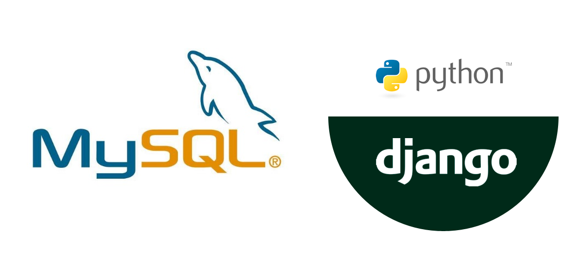
  </a>

  <h3 align="center">MySQL-Django-Tutorial</h3>
  <p align="center">
   Simple tutorial how create Django application, connect it to MySQL Database and perform MySQL queries in Django application.
  </p>
</p>

## 1. Download MySQL
- Go to this URL -> https://dev.mysql.com/downloads/mysql/
- Press “Go to download page” and download second installer


## 2. Install MySQL
- Lunch downloaded file (for example: mysql-installer-community-8.0.27.0.exe)
- Key points:
    - While choosing the setup type, select the “Developer Default” option
    - Enter the MySQL Root password which will be strong and which you can remember
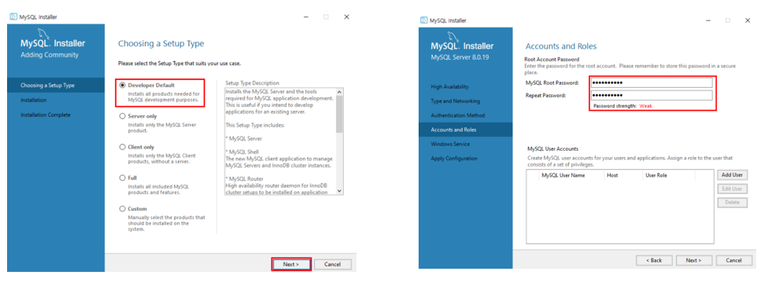


## 3. Initializing a new virtual environment 
3.1. Create working directory 
(in this example it is a folder called “project”)

3.2. Open the working directory from PyCharm
 
3.3. Click on “Terminal” which is located at bottom left side in PyCharm

3.4. Create virtual environment called “projectEnv”

```
$ python3 -m venv .projectEnv
```

3.5. Activate the virtual environment

```
$ .projectEnv\Scripts\activate.bat
```

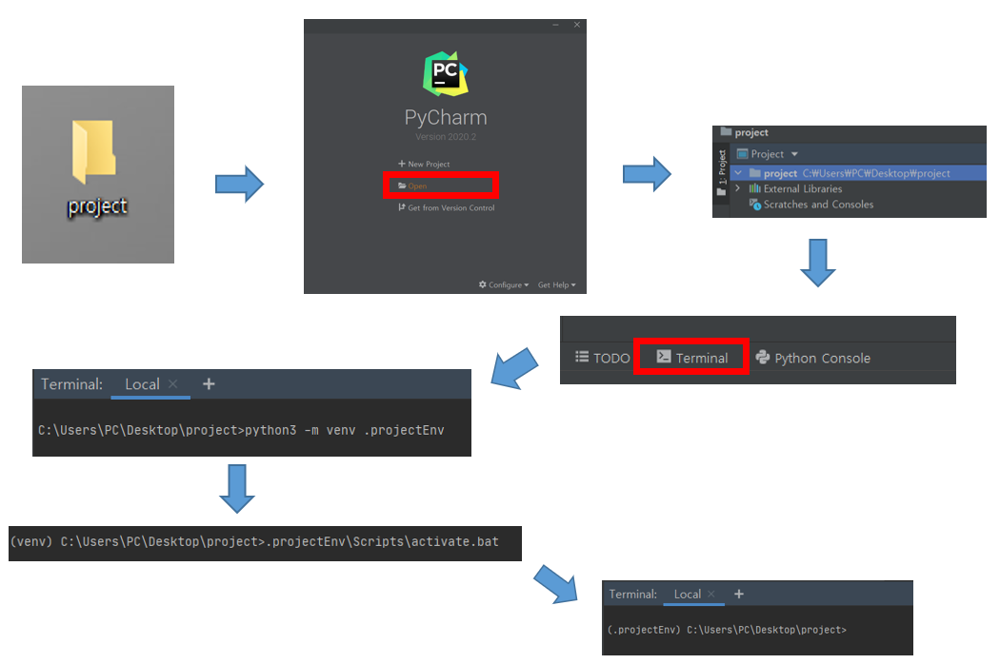

## 4. Installing Django and MySQL client
4.1. Install Django packages
```
$ pip install django
```
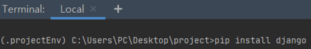


4.2. Install MySQL client for python
```
$ pip install mysqlclient
```
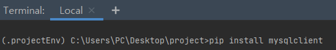

## 5. Create the new Django project
Start Django project called “category” using django-admin tool
```
$ django-admin startproject category 
```
After that our current working directory should look like this:

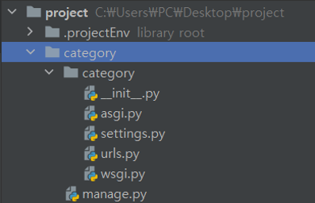


## 6. Change to project folder
6.1. Mark the project directory as root: Right click on project folder -> Mark Directory as -> Sources Root
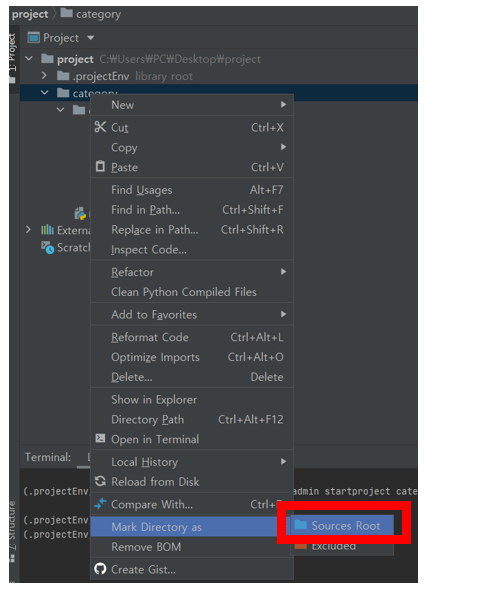

6.2. Change into project directory in terminal
```
$ cd category 
```
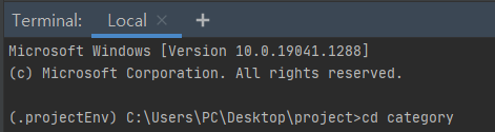

## 7. Create the new Django application
Create Django application called “myApp”
```
$ python manage.py startapp myApp 
```

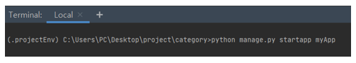

Then, our working directory will look like this:

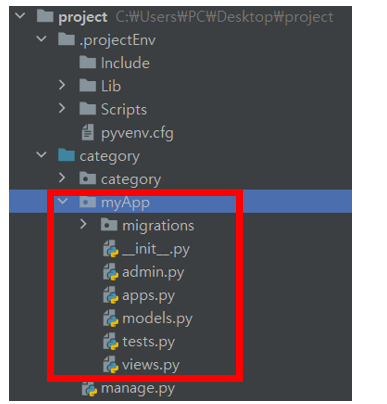

## 8. Registering myApp application
Open settings.py file add the new created application myApp to INSTALLED_APPS

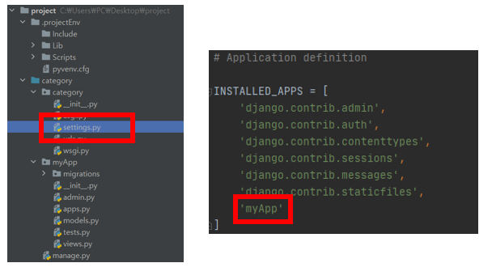


## 9. Testing the website framework 
9.1. Running database migrations:
```
$ python manage.py makemigrations 
```
```
$ python manage.py migrate
```

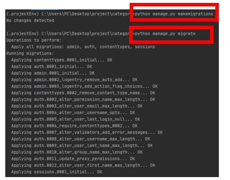

9.2. Running the server:
```
$ python manage.py runserver
```

The development server can be accessed at 
http://127.0.0.1:8000/
Here we can see that website framework was set up successfully: 
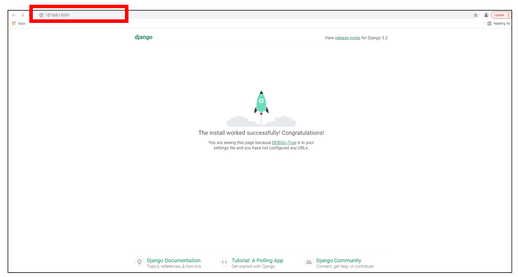


## 10. Creating MySQL Database
10.1. Open the MySQL Workbench and click on ⊕ button

10.2. Set up the connection name(here the name is “test”) and press ok
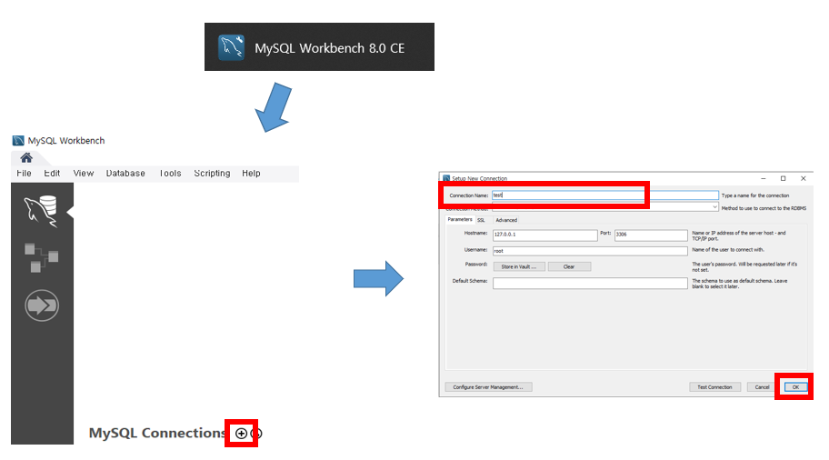

10.3. Double click on created connection “test” 

10.4. Enter the password of the root and click “OK”

10.5. Create database called “categoryDB” and press the button  
```
create database categoryDB;
```
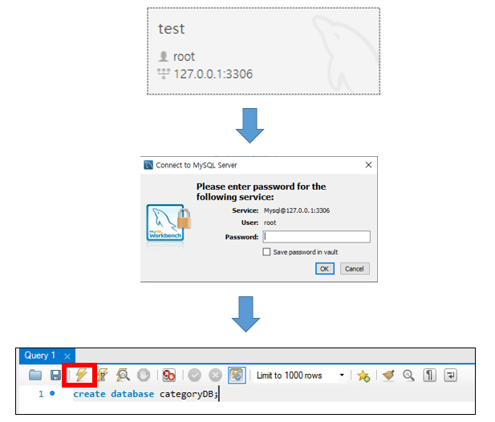

10.6. By clicking on update button we can see the new created database “categoryDB”

10.7. Double click on “categoryDB”

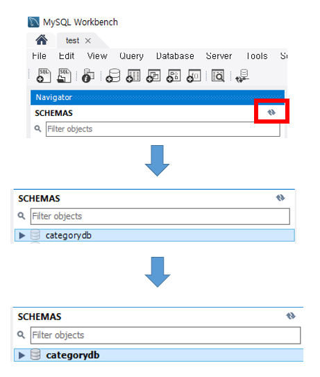

10.8. Create table called “Categories” and press the button
```
CREATE TABLE Categories (categoryID INT  NOT NULL, categoryName VARCHAR(50), categoryDescription CHAR(100), PRIMARY KEY (categoryID));
```

10.9. By pressing update button we can see that our table “Categories” is created
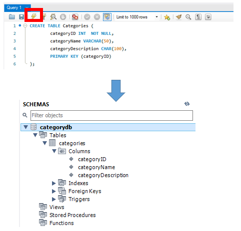

10.10. Add records “Categories” table 
```
INSERT INTO Categories (categoryID, categoryName,categoryDescription)
VALUES (1, 'Beverages', 'Soft drinks, coffees, teas, beers, and ales'), (2, 'Condiments', 'Sweet and savory sauces, relishes, spreads, and seasonings'), (3, 'Confections', 'Desserts, candies, and sweet breads'),(4, 'Dairy Products', 'Cheeses'),(5, 'Grains/Cereals', 'Breads, crackers, pasta, and cereal'),(6, 'Meat/Poultry', 'Prepared meats'),(7, 'Produce', 'Dried fruit and bean curd'),(8, 'Seafood', 'Seaweed and fish');
```
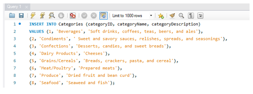

10.11. In order to see the records in the table:
Right click on category->SelectRows
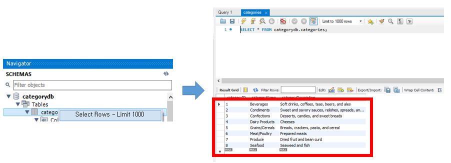


## 11. Connecting MySQL database to Django project

11.1. Open settings.py file and set up configurations of mySQL database “categoryDB”
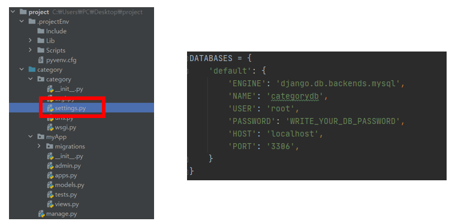

11.2. Run database migrations:
```
$ python manage.py migrate
```

## 12. Defining custom SQL queries in views 
First, we need to set up the views.py. 
Define the function “display” as following:

views.py
```python
from django.shortcuts import render
from django.db import connection

def display(request):
    outputCategories = []
    outputOfQuery1 = []
    with connection.cursor() as cursor:
        sqlQueryCategories = "SELECT categoryid, categoryname, categorydescription FROM categories;"
        cursor.execute(sqlQueryCategories)
        fetchResultCategories = cursor.fetchall()

        sqlQuery1 = "SELECT categoryname, categorydescription FROM categories WHERE categoryid=7;"
        cursor.execute(sqlQuery1)
        fetchResultQuery1 = cursor.fetchall()

        connection.commit()
        connection.close()

        for temp in fetchResultCategories:
            eachRow = {'categoryid': temp[0], 'categoryname': temp[1], 'categorydescription': temp[2]}
            outputCategories.append(eachRow)

        for temp in fetchResultQuery1:
            eachRow = {'categoryname': temp[0], 'categorydescription': temp[1]}
            outputOfQuery1.append(eachRow)

    return render(request, 'myApp/index.html',{"categories": outputCategories, "output1": outputOfQuery1})
```

## 13. Creating templates
13.1. In settings.py add path to “templates” which will store the templates used by application 

13.2. In the myApp directory, create templates directory and inside of it create another directory which will have same name as the application

13.3. Then right click on new created directory “myApp”-> Press New->HTML File

13.4. Name it as “index” and press enter
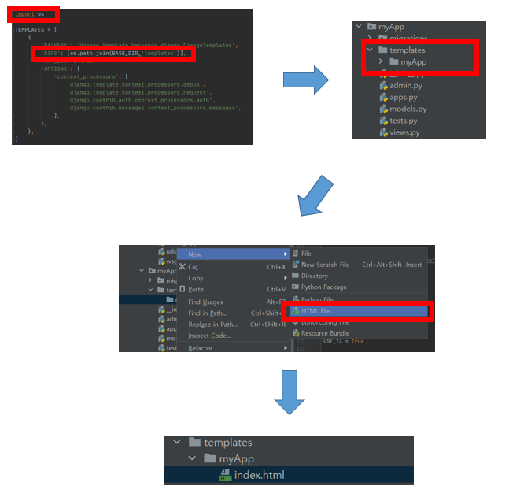

13.5. Add the following to index.html

index.html
```javascript
<!DOCTYPE html>
<html>
<head>
    <meta charset="UTF-8">
    <title>Categories Database:</title>
</head>
<body>
<h2>Categories table</h2>
<table>
    <thead>
        <tr>
        <th>category id</th>
        <th>category name</th>
        <th>category description</th>
    </tr>
    </thead>

    <tr>
        <td>{{ category.categoryid }}</td>
        <td>{{ category.categoryname }}</td>
        <td>{{ category.categorydescription }}</td>
    </tr>

</table>
<br>
<br>
<h2>Example query result:</h2>
<table>
    <thead>
        <tr>
            <th>category name</th>
            <th>category description</th>
    </tr>
    </thead>

    <tr>
        <td>{{ i.categoryname }}</td>
        <td>{{ i.categorydescription }}</td>
    </tr>

</table>
</body>
</html>
```

## 14. Creating URLs
After that,we need to create urls in urls.py to have access to views. 
Update the urls.py file as following:

urls.py
```python
from django.urls import path
from myApp import views

urlpatterns = [
    path('', views.display, name='index'),
]
```

## 15. Run the development server
Running the server:
```
$ python manage.py runserver
```
We should get following output:

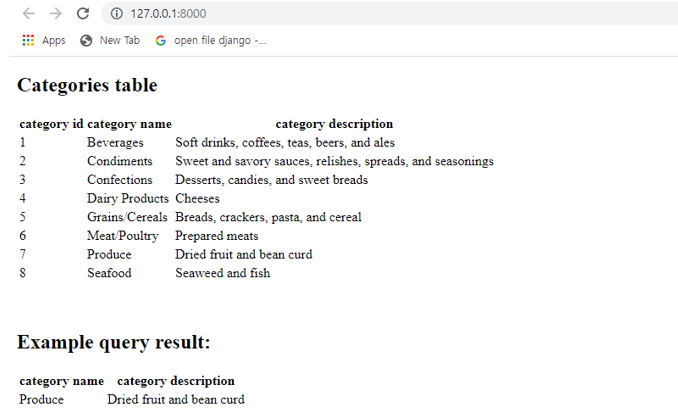